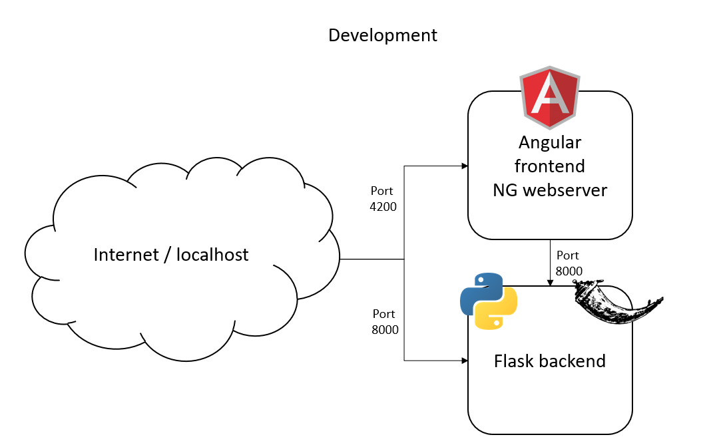
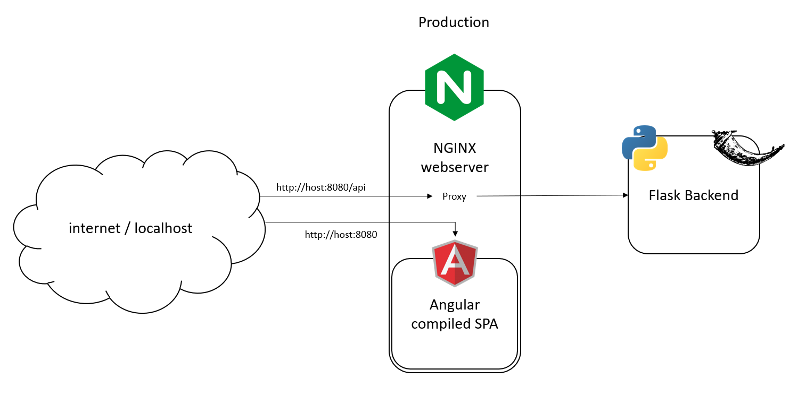

# Angular Flask Containerized

This project gives a working base structure for a containerized Application with an Angular Frontend and a Flask Backend

The application has a development and a production setup which can be executed as follows


# Development

```docker-compose -f docker-compose.dev.yml up --build```

The Angular frontend will be accessible at `http://localhost:4200`

The Flask backend will be accessible at `http://localhost:8000` running under `gunicorn` with the reload option enabled.
You can change these ports in the docker-compose.dev.yml



# Production

```docker-compose up --build```

The Angular frontend will be compiled and an NGINX Server will be started, which will serve the frontend and act as a proxy to the Flask backend.

The Angular frontend will be accessible at `http://localhost:8080`
The Flask backend will be accessible at `http://localhost:8080/api`
The reload option is disabled in production mode, meaning that changes will only be applied, when the service is restarted

